

Healthcare Data Security &amp; Clinical Workflow Architecture Report

JEEVAFLOW

Secure Healthcare Document Intelligence &amp; Doctor-Ready Clinical Workflow

“From Scattered Patient Documents to Controlled, Source-Linked Clinical Review”

WhatsApp is only the communication channel. JeevaFlow is the controlled healthcare-data environment.

Prepared byTeam Geek

Report date2 October 2026

CodebaseJeevaFlow API 2.0.0 (FastAPI) · React 19 / Vite frontend

StatusHackathon MVP · development environment · synthetic data only

Every feature and security claim in this report was checked against the source code, the automated test suites and a live run on an isolated synthetic instance. Anything not implemented is labelled as planned or future work.

<!-- TOC:START -->
## Contents

1. Executive Overview
2. Complete System Architecture
3. WhatsApp Security
4. Patient Authentication
5. Consent Management
6. Document Security
7. OCR and Information Extraction
8. Source Provenance
9. Doctor-Ready Form
10. Conflict Detection
11. Care Loops / Commitments
12. Doctor Authentication and MFA
13. Role-Based Access
14. Consent-Based Authorization
15. Evidence Security
16. Access Revocation
17. Audit Trail
18. Tamper Demonstration
19. Data Retention
20. Security Status
21. Frontend
22. Backend and Verified Technology Stack
23. API Architecture
24. Complete End-to-End Demo
25. Security & Test Validation
26. Security Threat Model
27. Security Design Principles
28. What JeevaFlow Does Not Do
29. Limitations / Development Status
30. Future Extensions
31. Final Security Summary
- Appendix A. Audit Method and Evidence
<!-- TOC:END -->

## Executive Summary

**JeevaFlow** turns the medical documents that patients already send through messaging apps (prescriptions, lab reports, follow-up results) into a **consent-controlled, source-linked clinical view** that an authorized doctor can review in minutes.

Its core design rule is printed on every screen of the application:

WhatsApp is only the communication channel. JeevaFlow is the controlled healthcare-data environment.

What the audit verified:

| Area | Verified state (2 Oct 2026) |
|---|---|
| Channel | Twilio-signed WhatsApp webhook; signature, replay, account, freshness and rate-limit checks; generic replies only |
| Patient trust | Transaction-bound 6-digit OTP (HMAC-stored, 5 min, single use, 5 attempts); explicit, scoped, time-limited consent |
| Documents | Validation → isolated worker (structural PDF scan, sanitise) → malware scan → AES-256-GCM vault → quarantine until OTP + consent |
| Clinical organisation | Deterministic, rule-based extraction; quote-or-reject provenance; timeline; conflict detection; care loops closed only by humans |
| Clinician access | Password (scrypt) + TOTP MFA; consent and scope re-checked on every request; single-use watermarked evidence views |
| Accountability | SHA-256 hash-chained, HMAC-signed, append-only audit trail with auditor verification and a tamper demonstration |
| Tests | **156 automated backend tests passed** and **8 frontend tests passed** in the development environment; **13/13 live end-to-end checks passed** |

**What JeevaFlow is not.** It does not diagnose, prescribe, change medication or decide which of two conflicting values is correct. It organises documented information for authorized human review. It has **not** been certified against any regulation (HIPAA, DPDP or other), and several controls are explicitly demo-grade (Section 29).

## 1. Executive Overview

### 1.1 The problem

Patients carry their health history as loose PDFs, phone photos and forwarded messages. In practice this creates eight recurring problems:

| Problem | What goes wrong |
|---|---|
| Fragmented information | Prescriptions, lab reports and follow-ups sit in different chats, phones and inboxes |
| Difficult clinical review | A doctor must open and read every file to reconstruct the history |
| Uncertain provenance | A typed summary cannot be traced back to the page it came from |
| Consent management | “I sent it on WhatsApp” is not a record of who may see what, for how long |
| Unauthorized access | Chat histories are forwarded, backed up and shared without control |
| Weak auditability | Nobody can say who viewed which document and when |
| Duplication and conflicts | The same test appears twice with different values; nobody notices |
| Long-term retention risk | Medical files stay in chat backups indefinitely |

Instructions such as *“Repeat HbA1c after 3 months”* are written once and then forgotten, because nothing tracks whether they happened.

### 1.2 The JeevaFlow approach

JeevaFlow keeps the convenience of messaging for the **interaction**, but moves the **data** into a controlled environment:

1. **Receives** documents through a communication channel (WhatsApp via Twilio) or the patient portal.
2. **Validates and sanitises** them in an isolated worker process, then scans them.
3. **Authenticates** the patient with a one-time code bound to a transaction.
4. **Obtains explicit consent** naming the doctor, the data scopes and the duration.
5. **Stores** each document encrypted with its own key, quarantined until verified.
6. **Extracts** lab values, instructions, medications and allergies with deterministic rules.
7. **Preserves source evidence:** every item keeps its exact quote, page and position.
8. **Builds a patient timeline** ordered by the report date found in each document.
9. **Identifies conflicts and care loops:** disagreeing values and unfinished instructions.
10. **Presents a doctor-ready form** to the consented doctor only, after password + TOTP sign-in.
11. **Provides auditable evidence access** through single-use, watermarked page views.
12. **Supports revocation and lifecycle controls:** consent revocation, document deletion by key destruction and automatic retention expiry.

The guiding phrase in the README is *“AI reads. Rules validate. Humans decide.”* In the current codebase the reading is done by **text-layer extraction and local OCR**, not by a generative-AI model (Section 7).

## 2. Complete System Architecture

The full architecture is shown in Figure 2.1 after the component table.

### 2.1 Components

| # | Component | What it does | Code |
|---|---|---|---|
| 1 | Patient | Sends a document or texts “Hi” from an enrolled WhatsApp number | — |
| 2 | WhatsApp / Twilio | Transport only; Twilio signs every webhook call | external |
| 3 | Webhook | `POST /api/v1/webhooks/whatsapp`; body cap, invalid-signature attempts limited per IP, valid messages limited per sender and patient, HTTPS required in production | `routes/webhook.py` |
| 4 | Signature verification | `X-Twilio-Signature` HMAC-SHA1 check, constant-time, fails closed (503 if not configured, 403 if invalid) | `whatsapp.py` |
| 5 | Transaction + OTP | `txn_<random>` binds patient, OTP, consent and documents; expires after 30 min | `security/otp.py` |
| 6 | Portal session | `POST /api/v1/portal/verify` issues a 15-minute HttpOnly session and a CSRF token | `routes/portal.py`, `security/auth.py` |
| 7 | Consent engine | Doctor, purpose, scopes, 1/7/30-day expiry; revoke or end now | `security/consent.py` |
| 8 | Secure ingestion | Size/type/magic-byte validation, isolated inspection and sanitisation, malware scan, SHA-256 dedupe | `pipeline.py`, `storage.py` |
| 9 | Validation / quarantine | New documents are stored as `QUARANTINED`; nothing is read until OTP and consent | `pipeline.receive_document()` |
| 10 | Encrypted vault | AES-256-GCM per document with a wrapped data key; crypto-shredding on delete | `vault.py`, `security/crypto.py` |
| 11 | OCR / extraction | PDF text layer or local Tesseract, in a fresh isolated process | `worker.py`, `extraction.py`, `facts.py` |
| 12 | Structured facts | Observations, instructions (commitments), medications, allergies, prescriber | `models.py` |
| 13 | Source provenance | Quote-or-reject anchoring with page, character span, bounding box, confidence | `provenance.py` |
| 14 | Patient timeline | Documents, observations and instructions ordered by report date | `timeline.py` |
| 15 | Conflict detection | Same test, same date, different values → human review | `conflicts.py` |
| 16 | Care-loop tracking | Instructions tracked as Open Loops; system suggests, humans close | `loops.py`, `matching.py` |
| 17 | Doctor authentication | Username + scrypt password, then TOTP | `routes/auth.py`, `security/auth.py` |
| 18 | Consent-based authorization | `authorize_doctor()` on every patient-data request | `security/consent.py` |
| 19 | Doctor-ready form | Consent-scoped clinical summary with evidence links | `doctor_brief.py` |
| 20 | Evidence access | Single-use 60-second token → watermarked page render | `routes/doctor.py`, `worker.py` |
| 21 | Audit trail | Hash-chained, HMAC-signed, append-only events; auditor verification | `security/audit.py` |

Two supporting stores keep identities apart from medical data: **`identity.db`** holds names, encrypted phone numbers (with an HMAC blind index), staff accounts, sessions and the audit anchor. **`jeevaflow.db`** knows patients only by a random `pt_…` reference.

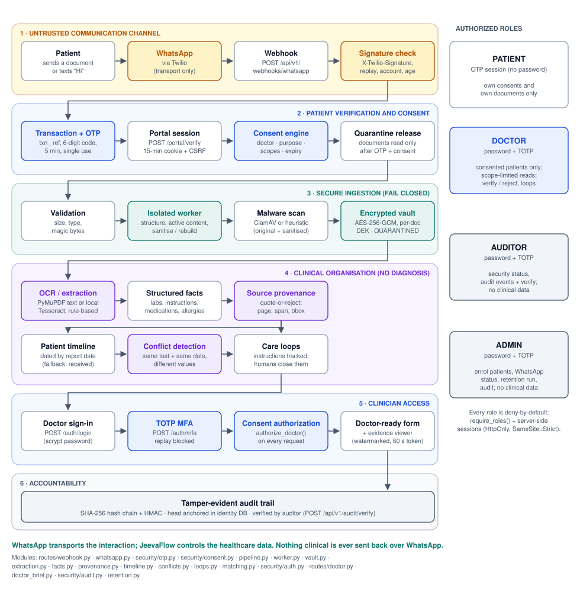

Figure 2.1 — End-to-end architecture. Boxes name the real endpoints and functions. Roles on the right are the four authenticated principal types found in <code>identity.py</code> (<code>Role</code>).

## 3. WhatsApp Security

WhatsApp transports the interaction; JeevaFlow controls the healthcare data.

WhatsApp (through Twilio) is treated as an **untrusted transport**. It authenticates nothing on JeevaFlow’s behalf and grants no access: being able to send a WhatsApp message only ever leads to a *verification request*, never to data.

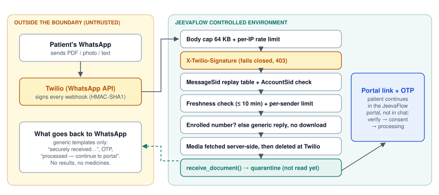

Figure 3.1 — Checks applied, in order, inside <code>process_webhook()</code> and <code>handle_inbound_message()</code>.

### 3.1 What is implemented

| Control | Implementation | Evidence |
|---|---|---|
| Signature | `X-Twilio-Signature` = HMAC-SHA1 over URL + sorted parameters, compared in constant time; the public URL is configurable so signatures verify behind a tunnel | `test_unsigned_and_wrongly_signed_requests_are_rejected` |
| Fail closed | No signing token configured → 503; invalid signature → 403 and `WEBHOOK_SIGNATURE_REJECTED` audit | `test_webhook_fails_closed_without_signing_token` |
| Replay | `MessageSid` stored in a processed-message table; a repeat is ignored; malformed SIDs rejected | `test_replayed_message_sid_is_ignored` |
| Account / freshness | `AccountSid` must match; message age checked against Twilio’s record (10-minute window) | `test_account_mismatch_rejected`, `test_stale_message_is_dropped` |
| Rate limits | Invalid-signature attempts are limited per IP; valid messages are limited per sender and patient; 64 KB body cap | `tests/test_ratelimit.py` |
| Unknown senders | Generic reply; media is **never downloaded**; no patient is created | `test_unenrolled_number_gets_generic_reply_and_no_download` |
| Media handling | Fetched server-side; credentials sent only to `https://*.twilio.com`; size and status enforced; deleted from Twilio afterwards | `test_download_sends_credentials_only_to_twilio`, `test_media_deletion_targets_only_twilio_media` |
| Ingestion | Media goes through `receive_document()` and stays **quarantined** until OTP + consent | `test_media_is_quarantined_until_otp_and_consent` |

### 3.2 Generic replies

All replies come from a fixed template set (`REPLIES` in `whatsapp.py`). Examples verified live:

- *“Your document has been securely received. Verification required: open {link} and enter the code from the next message.”*
- *“Your JeevaFlow verification code is ••••••. It expires in 5 minutes. Never share this code with anyone.”*
- *“Your document has been processed. Continue to the verified JeevaFlow portal.”*

No reply ever contains a diagnosis, result, medicine, prescription text or preview (`test_replies_contain_no_medical_information`). TwiML output is XML-escaped (`test_twiml_is_escaped`).

### 3.3 Demo simulator

`POST /api/v1/demo/whatsapp` builds a Twilio-style form, signs it with the configured signing token and sends it through the **real** webhook code path. Only the Twilio media download is replaced by the local synthetic file; media deletion, freshness and outbound notifications are reported as `SIMULATED` when Twilio credentials are absent, which was the case for this audit. A **Forged signature** button flips one character of the signature to show the 403 (`test_tampered_demo_signature_is_rejected`).

## 4. Patient Authentication

Patients never create a password. Every portal session starts from a **transaction** created by the webhook for an enrolled number, and is unlocked by a **one-time passcode** delivered to that number.

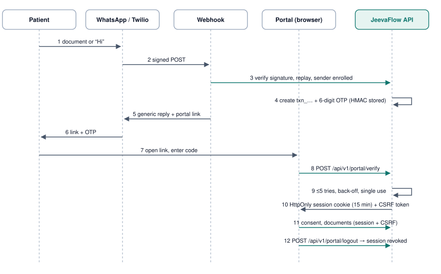

Figure 4.1 — Patient → WhatsApp → secure link → JeevaFlow portal → OTP → verified session.

### 4.1 OTP rules (security/otp.py)

| Rule | Value |
|---|---|
| Code | 6 digits from a CSPRNG (`secrets.randbelow`) |
| Validity | 5 minutes, single use |
| Storage | Only `HMAC-SHA256(server secret, otp + transaction ref)`; plaintext never stored or logged |
| Attempts | At most 5, with exponential back-off between attempts (≤ 30 s); the transaction locks after the 5th failure |
| Comparison | Constant-time; an HMAC is computed even for unknown transactions so timing does not reveal valid references |
| Errors | One generic message: “Verification failed or expired.” |
| Transaction | `txn_<random>` (≈128-bit), expires after 30 minutes; expired/locked transactions trigger shredding of their unverified documents |

### 4.2 Session lifecycle

- **Verify:** `POST /api/v1/portal/verify` revokes any earlier portal session for the patient (one live session per patient), then creates a server-side session.
- **Session:** random 32-byte token in an `HttpOnly`, `SameSite=Strict` cookie scoped to `/api`; the database stores only an HMAC of the token; lifetime **15 minutes**.
- **CSRF:** every state-changing request must send `X-CSRF-Token`, derived from the session; the frontend keeps it in memory only.
- **Logout:** `POST /api/v1/portal/logout` revokes the session server-side and clears the cookie.

**Why OTP.** The OTP proves possession of the registered phone *at the time of the request* without asking patients to manage credentials, and binds that proof to one transaction. A forwarded portal link alone is useless without the code; a leaked code alone is useless without the transaction reference; and both expire quickly. Tests: `test_incorrect_otp_and_generic_error`, `test_otp_brute_force_locks_transaction`, `test_otp_backoff_blocks_rapid_retries`, `test_otp_is_single_use`, `test_expired_otp`, `test_otp_never_stored_in_plaintext`, `test_transaction_refs_are_random_and_not_sequential`.

## 5. Consent Management

Consent in JeevaFlow is **explicit, scoped, time-limited, revocable and enforced on the server**. It is created by the verified patient in the portal, never by a doctor and never implied by sending a message.

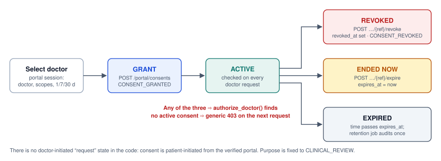

Figure 5.1 — Consent states as implemented (<code>consent_status()</code>: ACTIVE, REVOKED, EXPIRED).

### 5.1 What a consent contains

| Field | Values in code |
|---|---|
| Doctor | One active staff user with role `DOCTOR`, chosen from a list |
| Purpose | `CLINICAL_REVIEW` (the only purpose currently defined) |
| Scopes | Any of `DEMOGRAPHICS`, `MEDICATIONS`, `LABS`, `ALLERGIES`, `INSTRUCTIONS`, `SOURCE_DOCUMENTS` (at least one) |
| Duration | 1, 7 or 30 days |
| Lifecycle | `granted_at`, `expires_at`, `revoked_at`; audited as `CONSENT_GRANTED`, `CONSENT_REVOKED`, `CONSENT_EXPIRED` |

**About “request”:** the code has no doctor-initiated consent *request* state. The lifecycle is *select doctor → grant → active → revoked / ended now / expired*.

### 5.2 Enforcement properties

- **Tied to access:** documents in a transaction are only decrypted and read *after* consent is granted (or an existing active consent is applied with `POST …/consents/{ref}/apply`).
- **Checked per request:** every doctor route calls `authorize_doctor()`, which queries for a non-revoked, non-expired consent from *this* patient to *this* doctor for *this* purpose, covering the scope being read.
- **Immediate revocation:** `POST …/revoke` sets `revoked_at`; `POST …/expire` (“End now”) sets `expires_at` to now. Either way the very next doctor request fails.
- **Expiry:** once `expires_at` passes, access stops; the retention job records `CONSENT_EXPIRED` once.

### 5.3 Demonstrated behaviour

<strong>A doctor only sees patients who have granted that doctor an active consent.</strong> Live run: the synthetic patient granted consent to <em>Dr. Example</em>. Dr. Example’s patient list contained exactly that patient; <em>Dr. Other</em>, with no consent, saw an empty list and received <code>403</code> when requesting the same patient’s form directly. The rule is symmetric: had the patient consented to Dr. Other instead, the outcome would be reversed.

| Consent state | Doctor | Result |
|---|---|---|
| Active consent to Dr. Example | Dr. Example | Patient listed; form, journey, loops, conflicts available within scopes |
| No consent | Dr. Other | Empty list; direct request → generic 403 |

This matters because the alternative (any authenticated doctor can open any patient) turns a single stolen staff login into a breach of every record. With consent-bound access, the blast radius is limited to the patients who chose that doctor, for the scopes and duration they chose. Tests: `test_doctor_without_consent_is_denied`, `test_wrong_doctor_is_denied`, `test_expired_consent_denied`, `test_patient_can_expire_consent_now`, `test_doctor_form_respects_scope`.

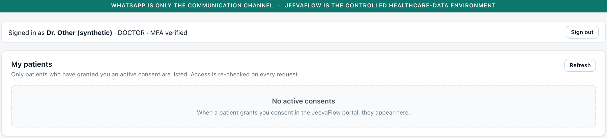

Figure 5.2 — Dr. Other (MFA-verified) has no active consents and therefore sees no patients.

## 6. Document Security

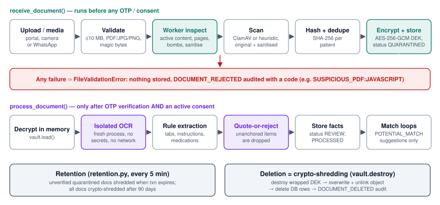

Figure 6.1 — <code>receive_document()</code> secures a file before anyone is verified; <code>process_document()</code> reads it only after OTP and consent.

### 6.1 Intake and validation

- **Formats:** PDF, JPEG, PNG only; up to **10 MB** (configurable) and **30 PDF pages**.
- **First line (`storage.py`, no parsing):** empty file, size, declared type and **magic bytes** must agree (`CONTENT_MISMATCH` otherwise).
- **Isolated worker (`worker.py`):** all parsing of untrusted bytes happens in a separate process (Section 7.1). For PDFs it rejects encrypted files, bad page geometry and too many pages, and runs a **structural active-content scan** (`security/pdf_active_content.py`). The scan walks the parsed object tree and rejects JavaScript, non-navigation `OpenAction`, `/AA` additional actions, Launch, SubmitForm/ImportData/GoToR/GoToE, rich media and XFA, and embedded files. Unparseable structures fail closed. An inert C2PA provenance manifest is the only attachment accepted, and sanitisation strips it.
- **Sanitisation:** PDFs are scrubbed (metadata, links, JavaScript, attachments, form data, thumbnails) and rebuilt; the rebuilt copy is re-scanned and must contain no attachments. Images are re-encoded, which drops EXIF/GPS metadata and any appended payload; decompression bombs and animated images are rejected.
- **Malware scan (`security/scanner.py`):** ClamAV (`clamdscan`/`clamscan`) when installed, otherwise a heuristic scanner (EICAR, embedded PE/ELF/Mach-O/ZIP signatures, script in images, PDF action keywords). Both the original and the sanitised bytes are scanned; scanner errors fail closed. **In this environment the heuristic engine was active** (ClamAV not installed). This is reported as *DEMO IMPLEMENTATION* by the security dashboard.
- **Integrity:** SHA-256 of the original is recorded and used for per-patient deduplication; the sanitised copy’s hash is stored separately.

Rejected files are **never stored**: the upload fails with a user-safe message and a `DOCUMENT_REJECTED` audit event carrying only a code (for example `SUSPICIOUS_PDF:JAVASCRIPT`).

### 6.2 Quarantine

Accepted documents are encrypted and stored with status **`QUARANTINED`**. Nothing is extracted from them until the patient has verified the OTP **and** an active consent exists (`test_media_is_quarantined_until_otp_and_consent`, `test_portal_upload_requires_active_consent`). If the transaction expires or locks first, the retention job crypto-shreds them (`test_expired_unverified_transaction_documents_are_shredded`).

### 6.3 Encrypted storage

| Layer | Implementation (`security/crypto.py`, `vault.py`) |
|---|---|
| Documents | Envelope encryption: random 256-bit **data key (DEK) per document**, AES-256-GCM, unique nonce, document reference as associated data |
| Key wrapping | DEK wrapped by a key-encryption key (KEK) through a `KeyProvider` interface; the current provider reads the KEK from the environment |
| Database fields | Medical text columns encrypted with AES-256-GCM using an HKDF-derived key; identity columns use a **separate** identity key in a separate database |
| Phone lookup | HMAC-SHA256 blind index; no plaintext phone number stored |
| Binding | A ciphertext cannot be swapped between documents (`test_ciphertext_cannot_be_swapped_between_documents`) |

### 6.4 Deletion and identifiers

**Deletion is crypto-shredding** (`vault.destroy()`): the wrapped DEK is destroyed first, then the ciphertext is overwritten and unlinked, then database rows are removed and `DOCUMENT_DELETED` is audited (`test_delete_document_destroys_key_object_and_rows`). Patients can delete their own documents from the portal.

**Identifiers:** patients, documents, consents, transactions, facts and staff use opaque random references (`pt_…`, `doc_…`, `cns_…`, `txn_…`, `fct_…`, `usr_…`, ~128 bits). Observation, commitment and evidence records in the doctor API use **integer IDs**. These are protected by the same consent check and an identical 403 for unknown and unauthorized objects (`test_unknown_and_foreign_objects_look_the_same`), but they are not opaque (see Section 29).

## 7. OCR and Information Extraction

<strong>Honest classification.</strong> Extraction in JeevaFlow is <strong>deterministic and rule-based</strong> (regular expressions, a small formulary, plausibility ranges). Text comes from the PDF text layer (PyMuPDF) or from <strong>Tesseract OCR 5.5.3</strong> running locally. Tesseract’s recogniser is a trained LSTM model: that is the only machine-learned component, and it is ordinary OCR, not generative AI. <strong>No LLM is used, and no document or extracted value is sent to any external AI service</strong> (the security dashboard reports “External AI: DISABLED”).

### 7.1 Isolated processing worker

Every inspect, extract and render job runs in a **fresh Python process** (`worker_client.py` → `worker.py`), one job at a time. The worker:

- gets a minimal environment with no secrets;
- has no database access and no keys;
- has network egress blocked in-process;
- runs with core dumps disabled and a 120-second CPU limit;
- refuses to run as root;
- writes only to a private temporary directory that is deleted after the job.

Worker error text is never echoed, because it could contain document content. Tests: `test_worker_environment_has_no_secrets`, `test_worker_blocks_network`.

### 7.2 Pipeline

| Step | What happens | Code |
|---|---|---|
| Text | PDF pages with a text layer use PyMuPDF `get_text()` (`TEXT`) | `worker.op_extract` |
| OCR | Pages without text are rendered at 200 DPI and passed to Tesseract (`OCR`); word boxes and confidences are kept | `worker._ocr_words` |
| Image quality gate | Photos are checked for size, sharpness (variance of the Laplacian, OpenCV) and brightness → `GOOD`, `WARN` or `RETAKE`; `RETAKE` images are **not interpreted** | `quality.py` |
| Document date | “Report Date” / “Date” labels, day-first (DD/MM/YYYY); falls back to date received | `extraction.extract_document_date` |
| Lab observations | HbA1c, Glucose, Creatinine, LDL Cholesterol, Blood Pressure, with plausibility ranges that only reject obvious misreads | `extraction.OBSERVATION_PATTERNS` |
| Instructions | Lines starting with *repeat*, *follow-up with/in/after*, *review*, *refer to*, *recheck*; due date derived from a stated interval (“after 3 months”) | `extraction.COMMITMENT_PATTERNS` |
| Medications | Tab/Cap/Syp/Inj lines → name, dose, unit, frequency, duration; 20-entry reference formulary with dose ranges | `facts.extract_medications` |
| Allergies, prescriber | Allergy lines (incl. “NKDA”); prescriber name and registration number | `facts.py` |

### 7.3 Normalisation and fact states

Each medication field carries one of four states:

| State | Meaning | Example (synthetic prescription) |
|---|---|---|
| `SOURCE_FACT` | Read literally from the text | Atorvastatin 10 mg, “once daily at night”, 30 days |
| `AI_INFERRED` | A **rule-based** normalisation of source text; the original text is kept alongside | “1-0-1” → twice daily; “BD” → twice daily |
| `UNCERTAIN` | Unknown medicine, implausible dose/unit/duration, conflicting statements, or OCR confidence < 0.80 | “Zyxorin 50 mg” (not in the formulary) |
| `MISSING` | Not present in the source; value left empty, never invented | Glimepiride 1 mg: frequency and duration |

Despite its name, `AI_INFERRED` is produced by deterministic lookup rules, not by a model. Validation can only **lower** confidence; it never adds data (`test_never_invents_frequency_or_duration`, `test_unknown_medicine_is_uncertain`, `test_low_ocr_confidence_downgrades_to_uncertain`).

## 8. Source Provenance

Provenance is JeevaFlow’s core safety property: **an extracted item exists only if the exact text it came from can be found in the document.**

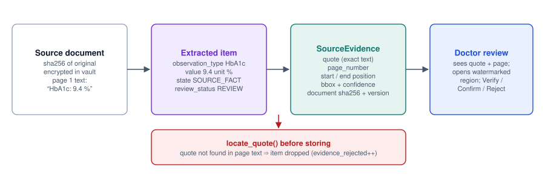

Figure 8.1 — SOURCE DOCUMENT → EXTRACTED FACT → SOURCE REFERENCE → DOCTOR REVIEW.

For every observation, instruction and clinical fact, a `SourceEvidence` row stores:

- the **exact quote**, page number and start/end character positions;
- the **bounding box** on the page (when locatable) and a confidence;
- the **document SHA-256** and the **pipeline version**.

Before anything is stored, `locate_quote()` re-checks the quote against the page text. **Items that cannot be anchored are dropped**, not stored (`evidence_rejected` in the response; `test_unanchored_extraction_is_rejected`, `test_every_fact_has_an_exact_quote`, `test_provenance_quote_or_reject`). The pipeline also re-checks quotes returned by the worker, which protects against a misbehaving worker.

All extracted observations start with review status **`REVIEW`**; only a doctor can mark them `VERIFIED` or `REJECTED`, and verification is refused for an item without evidence.

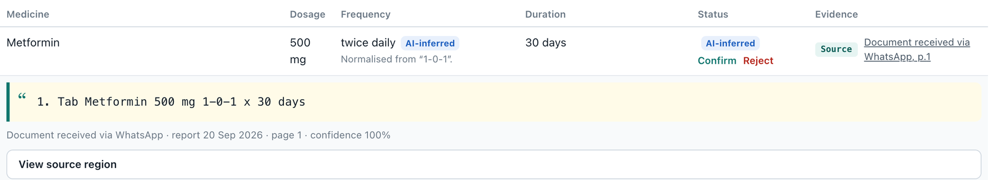

Figure 8.2 — In the doctor form, “Source” expands the exact quote, document, report date, page and confidence for each item.

**Why it matters:**

- **Traceability:** every value points to a page.
- **Clinical review:** the doctor checks the source, not a paraphrase.
- **Correction:** wrong items are rejected, and dependent suggestions are withdrawn.
- **Accountability:** every decision is attributed and audited.
- **Reduced ambiguity:** “where did this number come from?” always has an answer.

## 9. Doctor-Ready Form

The doctor-ready form (`GET /api/v1/doctor/patients/{patient_ref}/form`, built by `doctor_brief.py`) is the point of the whole pipeline. It turns four scattered synthetic documents into **one consent-scoped, source-linked page**.

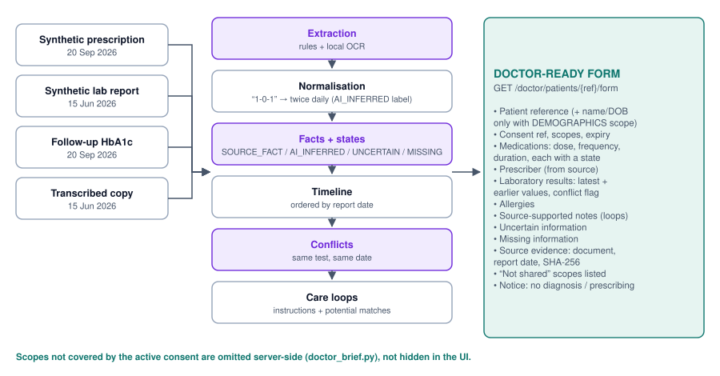

Figure 9.1 — From scattered documents to the doctor-ready form.

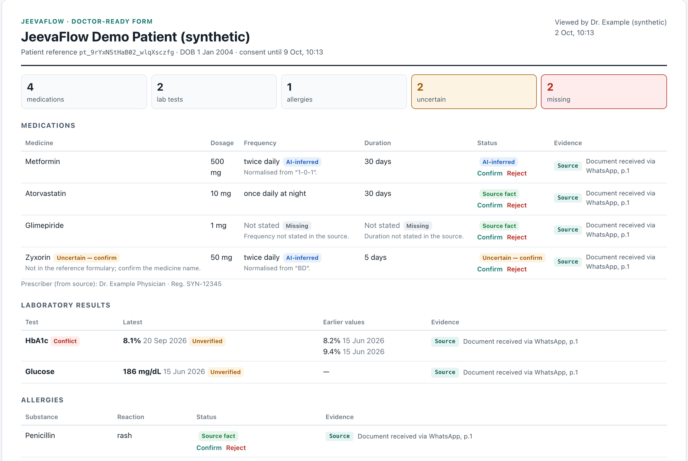

Figure 9.2 — Live doctor-ready form (synthetic patient): summary tiles, medications with per-field states and Confirm/Reject, laboratory results with conflict flag, allergies, each with a Source link.

### 9.1 Contents (as implemented)

| Section | Content | Scope required |
|---|---|---|
| Patient | Reference; name and date of birth only if shared | `DEMOGRAPHICS` |
| Consent | Reference, purpose, scopes, expiry, whether source viewing is allowed; scopes **not** shared are listed | — |
| Medications | Name, dose, frequency, duration, each field with its state; prescriber from source | `MEDICATIONS` |
| Laboratory results | Per test: latest value, earlier values, dates, review status, conflict flag | `LABS` |
| Allergies | Substance, reaction, state | `ALLERGIES` |
| Source-supported notes | Instructions / Open Loops with state, due date and documented date | `INSTRUCTIONS` |
| Uncertain information | Every `UNCERTAIN` field and every conflicted test | per section |
| Missing information | Every `MISSING` field (e.g. no frequency stated) | per section |
| Source evidence | Each processed document: label, report date, received time, pages, SHA-256, scan engine | — |
| Controls | Confirm / Reject facts; Verify / Reject observations; view source region | — |

Scopes outside the active consent are **omitted by the server**, not hidden by the UI (`test_doctor_form_respects_scope`, `test_instruction_scope_does_not_reveal_lab_values`). Rejected items are left out. Values are shown as written; nothing is labelled better or worse.

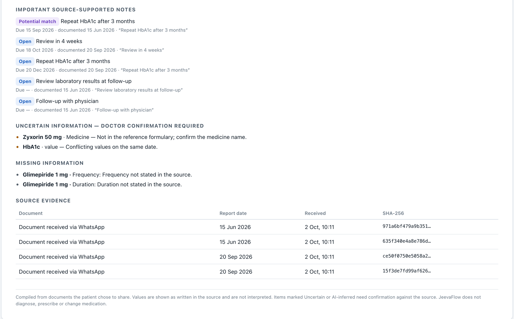

Figure 9.3 — Source-supported notes, uncertain and missing information, source evidence with SHA-256, and the standing notice.

The form carries a fixed notice: <em>“Compiled from documents the patient chose to share. Values are shown as written in the source and are not interpreted. Items marked Uncertain or AI-inferred need confirmation against the source. JeevaFlow does not diagnose, prescribe or change medication.”</em>

## 10. Conflict Detection

`detect_observation_conflicts()` (`conflicts.py`) groups non-rejected observations by **(test, date)** and reports a conflict when a group contains **more than one distinct (value, unit)**. The synthetic demo includes exactly this case:

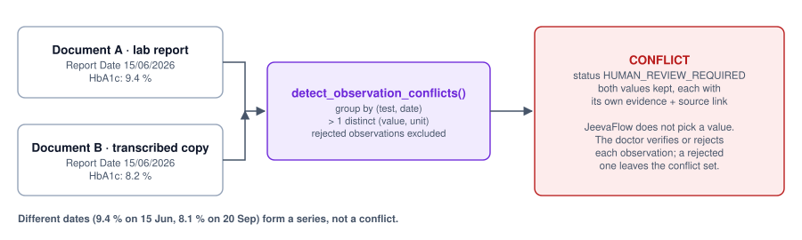

Figure 10.1 — Lab report and transcribed copy, both dated 15/06/2026, report HbA1c 9.4 % and 8.2 %.

| Step | Behaviour |
|---|---|
| Detect | Same test, same report date, different values → `type: CONFLICT` |
| Surface | `status: HUMAN_REVIEW_REQUIRED`, shown on the journey page, flagged in the form and listed under “Uncertain information” |
| Preserve | Both values are kept, each with its own evidence, document and source link |
| Review | The doctor verifies or rejects each observation; a rejected value leaves the conflict set |
| Never | JeevaFlow does **not** choose which value is correct |

Values on **different** dates form a longitudinal series, not a conflict. Live result: one conflict (HbA1c, 15 Jun 2026: 9.4 % vs 8.2 %); the 8.1 % follow-up on 20 Sep 2026 appears as a later value (`test_conflict_detection_and_rejection`, `test_followup_on_later_date_is_not_a_conflict`).

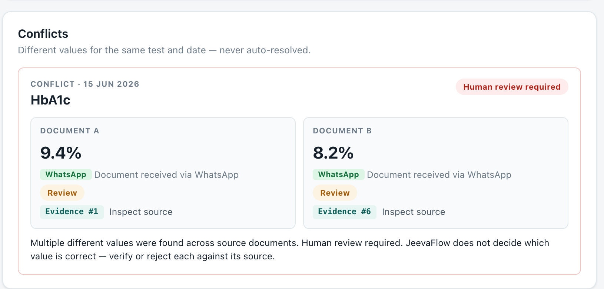

Figure 10.2 — Conflict panel in the doctor’s journey view.

The doctor remains responsible for clinical interpretation.

## 11. Care Loops / Commitments

Every documented instruction (“Repeat HbA1c after 3 months”, “Review in 4 weeks”) becomes a **commitment** tracked as an **Open Loop** until a person confirms it was followed through.

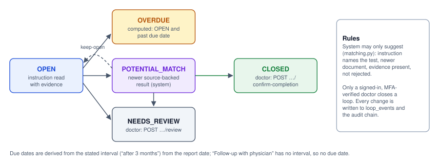

Figure 11.1 — Loop states (<code>LoopState</code>) and who may cause each transition.

| State | Meaning |
|---|---|
| `OPEN` | Instruction documented; nothing newer addresses it |
| `OVERDUE` | Computed: `OPEN` and past its due date |
| `POTENTIAL_MATCH` | A newer, source-backed result may fulfil it. **Awaiting a person** |
| `NEEDS_REVIEW` | A doctor flagged it (`POST …/commitments/{id}/review`) |
| `CLOSED` | A doctor confirmed completion (`POST …/commitments/{id}/confirm-completion`) |

**Matching rules (`matching.py`), all must hold:**

1. The loop is active.
2. The instruction names the test.
3. The result comes from a different, newer document.
4. The result has evidence and is not rejected.

**Doctor interaction:**

- **Confirm completion:** closes the loop; recorded under the MFA-verified doctor, not a typed name. It requires a potential match (`test_confirmation_requires_potential_match`).
- **Keep open:** dismisses pending matches and reopens the loop.
- **Review:** marks the loop `NEEDS_REVIEW`.
- Rejecting the observation behind a match **withdraws** the match (`test_rejecting_supporting_observation_withdraws_match`).

Every transition is written to `loop_events` and the audit chain (`LOOP_DECISION`).

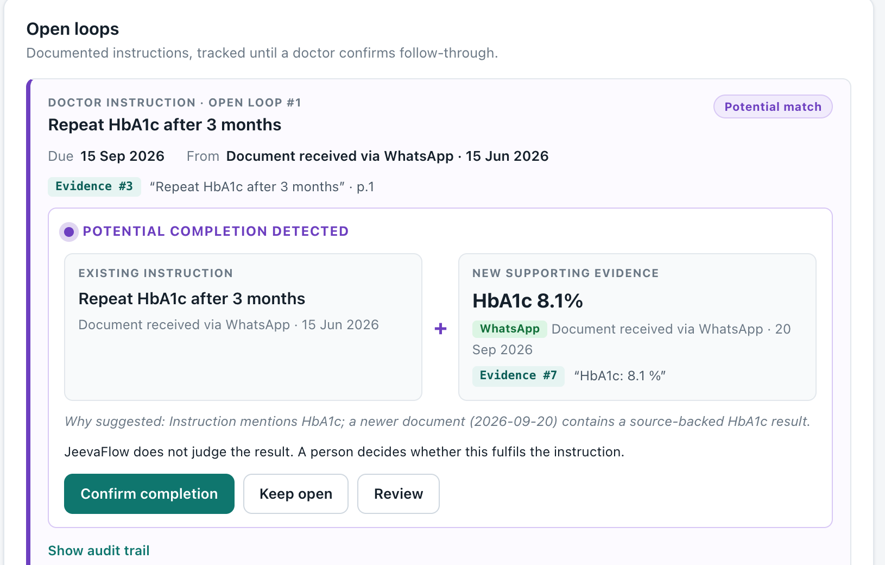

Figure 11.2 — Live: “Repeat HbA1c after 3 months” (15 Jun 2026, due 15 Sep 2026) has a potential match from the 20 Sep 2026 HbA1c 8.1 %. JeevaFlow states it does not judge the result; a person decides.

This prevents follow-up instructions from being buried inside scattered documents: they become visible, dated items with an owner and an outcome. In the live run the doctor saw five loops (one `POTENTIAL_MATCH`, four `OPEN`).

## 12. Doctor Authentication and MFA

Staff (doctors, auditors, admins) sign in with **two factors**: something they know and something they have.

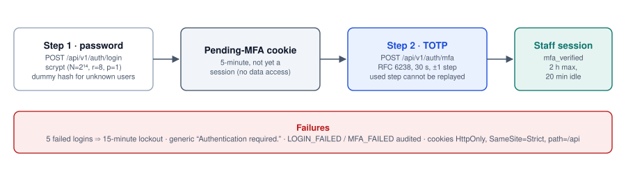

Figure 12.1 — Password + TOTP → authenticated staff session.

| Step | Implementation |
|---|---|
| 1. Password | `POST /api/v1/auth/login`; scrypt (N = 2¹⁴, r = 8, p = 1, 16-byte salt); unknown usernames cost the same time (dummy hash); success yields only a 5-minute *pending-MFA* cookie with no data access |
| 2. TOTP | `POST /api/v1/auth/mfa`; RFC 6238, 6 digits, 30-second step, ±1 step tolerance; a used step is stored and **cannot be replayed** |
| Session | Server-side; random token in an HttpOnly, SameSite=Strict cookie; only its HMAC stored; `mfa_verified` required by every staff route; 2-hour maximum, **20-minute idle timeout** |
| Failures | Generic errors; 5 failed logins → 15-minute lockout; `LOGIN_FAILED`, `MFA_FAILED`, `LOGIN_LOCKED` audited |
| CSRF | `X-CSRF-Token` required on every state-changing staff request; foreign `Origin` rejected |

**Why MFA matters here:** staff accounts are the only path to clinical data. A phished or reused password alone is not enough to sign in (`test_password_alone_is_not_enough`). Replaying an intercepted TOTP code within its window is also refused (`test_totp_code_cannot_be_replayed`). This was observed directly during this audit: a second sign-in with the same 30-second code returned 401.

**Demonstrated:** `PASS dr.example: password + TOTP MFA` and `PASS auditor: password + TOTP MFA` in the live smoke test. The **auditor** uses the identical two-step flow; auditor and admin sessions are subject to the same idle timeout, lockout and CSRF rules.

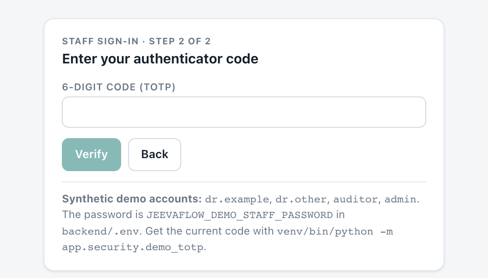

Figure 12.2 — Step 2 of staff sign-in. Demo TOTP codes come from a local command; no seed is shown in the UI.

## 13. Role-Based Access

Roles are defined in `identity.py` (`Role`) and enforced by `require_roles()` in `security/auth.py`: **deny by default**, every route declares the roles it accepts, and a wrong role produces a generic 403 plus a `DOCTOR_ACCESS_DENIED` audit with reason `ROLE`.

| Capability | PATIENT | DOCTOR | AUDITOR | ADMIN |
|---|:-:|:-:|:-:|:-:|
| Authenticate | OTP (portal) | password + TOTP | password + TOTP | password + TOTP |
| Own consents, own documents (`/portal/*`) | ✔ | — | — | — |
| Consented patients’ form, journey, loops, conflicts, evidence | — | ✔ (consent + scope) | ✗ 403 | ✗ 403 |
| Verify / reject observations and facts; loop decisions | — | ✔ (consent + scope) | ✗ | ✗ |
| Security status (`/security/status`) | — | ✔ | ✔ | ✔ |
| Audit events and chain verification (`/audit/*`) | — | ✗ 403 | ✔ | ✔ |
| Tamper / restore demo (`/demo/audit/*`, demo mode) | — | ✗ | ✔ | ✔ |
| Enrol patients, WhatsApp status/messages, run retention (`/admin/*`) | — | ✗ | ✗ 403 | ✔ |
| Any “list all patients” endpoint | does not exist | does not exist | does not exist | does not exist |

Verified live (2 Oct 2026):

| Request | Response |
|---|---|
| Auditor → doctor form | 403 |
| Admin → doctor form | 403 |
| Doctor → audit events | 403 |
| Auditor → retention run | 403 |
| Admin → audit events | 200 |
| Admin → retention run | 200 |

`SERVICE` and `SYSTEM` appear only as audit actor types for internal components (webhook, worker, retention); they are not login roles.

**Least privilege in practice:**

- Admins operate the platform but **cannot read medical content**.
- Auditors see codes and references, not clinical data.
- Doctors see only what each patient shared with them.

Tests: `test_role_separation`, `test_missing_authentication`, `test_no_list_all_patients_or_phone_lookup`.

## 14. Consent-Based Authorization

<strong>Authentication</strong> answers <em>“Who are you?”</em>. In JeevaFlow that means a password + TOTP staff session.

<strong>Authorization</strong> answers <em>“What are you allowed to see?”</em>. In JeevaFlow that means role + active consent + scope + resource.

A fully authenticated doctor still sees **nothing** without patient consent. `authorize_doctor()` runs on every patient-data request:

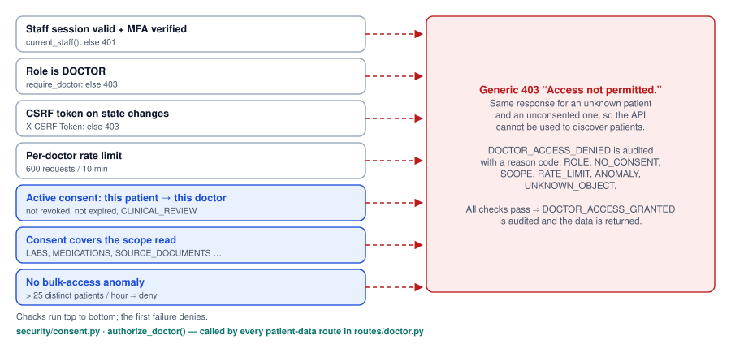

Figure 14.1 — Decision sequence: doctor identity + active patient consent + scope + requested resource → access.

Object-level routes (observation, fact, commitment, evidence) first resolve the object’s patient, then run the same check with the scope the object belongs to. Evidence additionally requires that the evidence is linked to a scope the consent covers. An unknown ID and an unconsented ID return the **same** 403.

| Scenario | Identity | Consent | Result |
|---|---|---|---|
| Dr. Example, patient consented to Dr. Example | MFA ✔ | active ✔ | Patient visible; data within scopes |
| Dr. Other, same patient | MFA ✔ | none ✗ | Not listed; direct request 403 |
| Dr. Example after revocation | MFA ✔ | revoked ✗ | 403 on the next request |
| Dr. Example, consent without `LABS` | MFA ✔ | active, scope ✗ | Lab values withheld; `/conflicts` 403 |

A bulk-access tripwire denies a doctor who touches more than 25 distinct patients within an hour (`ANOMALY_DETECTED`; `test_bulk_access_anomaly`).

## 15. Evidence Security

Original documents are **never downloadable**. A doctor sees one evidence region at a time, rendered as a watermarked image through a short-lived, single-use token.

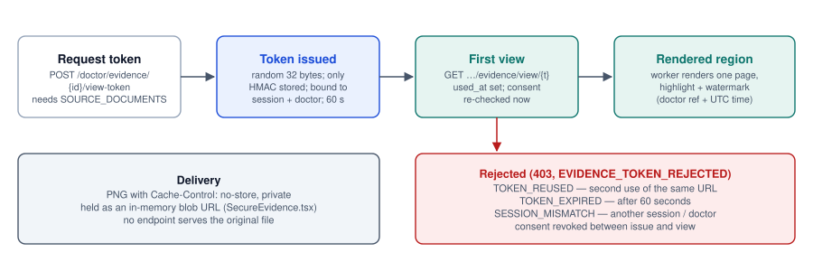

Figure 15.1 — Evidence token lifecycle (<code>routes/doctor.py</code>).

| Control | Implementation |
|---|---|
| Endpoints | `GET /doctor/evidence/{id}` (quote and linked items); `POST /doctor/evidence/{id}/view-token`; `GET /doctor/evidence/view/{token}` |
| Scope | Viewing the source region requires the `SOURCE_DOCUMENTS` scope |
| Token | 32 random bytes; only its HMAC is stored; bound to the doctor **and** the session; **60-second** expiry; rate-limited (60 per 10 min) |
| Single use | `used_at` is set on first view; a second request → 403 `TOKEN_REUSED` |
| Live consent | Consent is re-checked **at view time**, not only at issue time |
| Rendering | The isolated worker decrypts in memory, renders only the referenced page, highlights the evidence box and burns in a watermark (doctor reference + UTC time + “JeevaFlow confidential – do not copy”) |
| Delivery | PNG with `Cache-Control: no-store, private`; held in the browser as an in-memory blob URL (`SecureEvidence.tsx`) |
| Audit | `EVIDENCE_TOKEN_ISSUED`, `DOCUMENT_VIEWED`, `EVIDENCE_TOKEN_REJECTED` (with reason) |

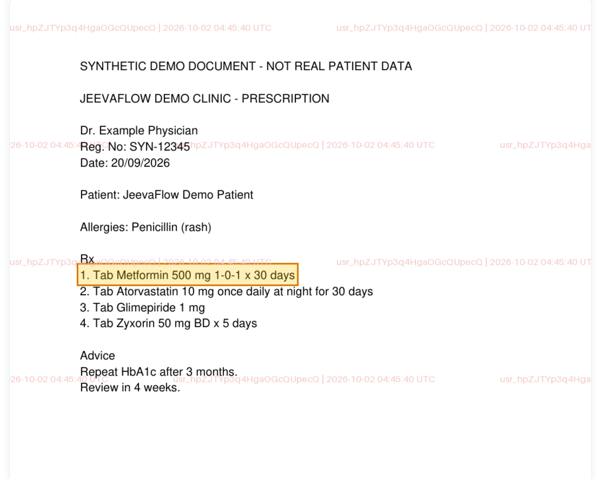

Figure 15.2 — Live watermarked evidence render: the Metformin line is highlighted; the doctor’s opaque user reference and timestamp are tiled across the page.

**Demonstrated:** `PASS watermarked evidence view`, `PASS evidence token is single use`. A privileged URL that is copied into a chat, a log or a browser history is worthless once used or after 60 seconds, and it cannot be opened from another session. The watermark discourages screenshots and makes any leaked image attributable. It cannot *prevent* someone photographing a screen.

## 16. Access Revocation

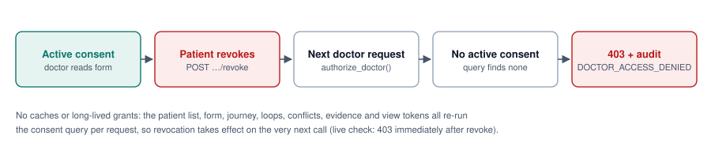

Figure 16.1 — ACTIVE CONSENT → doctor access → patient revokes → authorization check fails → access denied.

<strong>Access denied immediately after revocation.</strong> Revocation is enforced at <em>authorization time</em> on the server. It is not a UI change and not a cached flag. The consent query in <code>authorize_doctor()</code> runs on every request, so the doctor’s very next call fails.

The doctor’s patient list is computed from active consents on every request, so a revoked patient also disappears from “My patients”. Evidence tokens issued *before* revocation also fail, because consent is re-checked at view time (`test_evidence_view_requires_source_scope_and_live_consent`).

Live result (2 Oct 2026):

1. Before revocation, Dr. Example’s form request returned `200`.
2. The patient called `POST /portal/consents/{ref}/revoke`.
3. The next form request returned `403`, and the patient list was empty.

The patient portal offers two controls per active consent:

- **Revoke:** permanently withdraws the consent.
- **End now:** sets the expiry to the current time.

Both are audited.

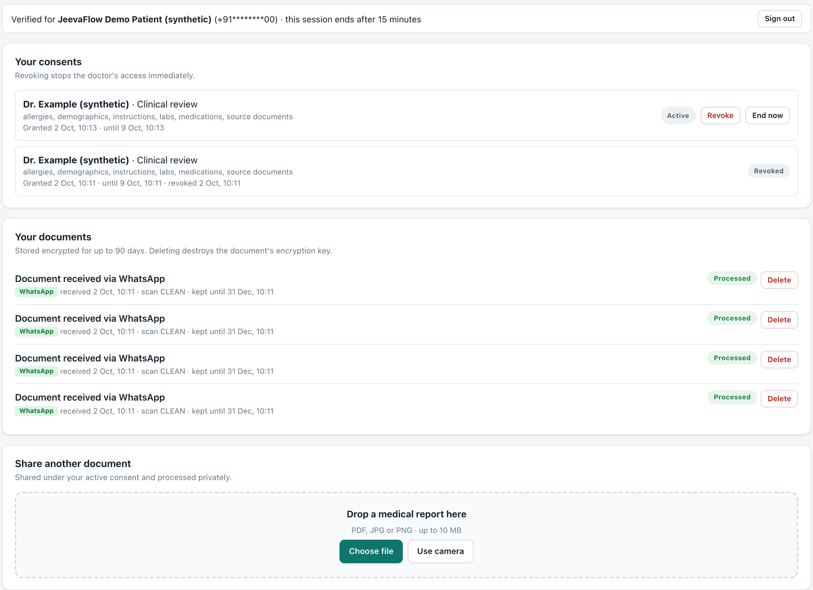

Figure 16.2 — Patient portal: active and revoked consents with Revoke / End now; documents with scan status, retention date and Delete (crypto-shred).

## 17. Audit Trail

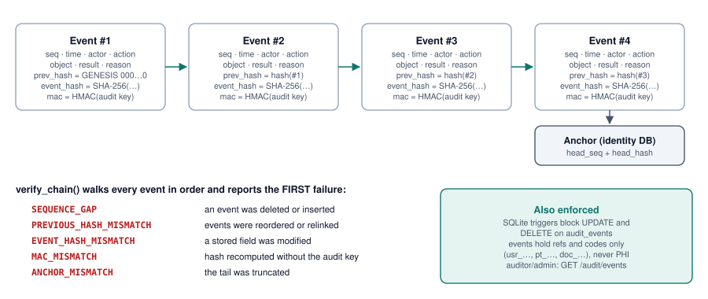

Figure 17.1 — USER ACTION → AUDIT EVENT → TAMPER-EVIDENT CHAIN → AUDITOR VERIFICATION.

### 17.1 How the chain works (security/audit.py)

1. Each event records the sequence number, timestamp, actor type and reference, action, object type and reference, result, reason, and the **previous event’s hash**.
2. `event_hash = SHA-256(canonical JSON of those fields)` and `mac = HMAC-SHA256(audit key, event_hash)`.
3. The latest `(head_seq, head_hash)` is written to an **anchor** in the separate identity database.
4. SQLite triggers make `audit_events` **append-only**: UPDATE and DELETE are refused (`test_audit_table_is_append_only`).
5. Events contain **only references and codes**. Values are validated against a safe pattern and replaced with `REDACTED` otherwise, so no PHI enters the log (`test_audit_events_contain_no_phi`).

An attacker who edits a row breaks its hash. Recomputing the hashes needs the audit key for the MAC. Deleting the newest events is caught by the anchor (`test_audit_detects_deleted_tail`).

### 17.2 Coverage

The audit trail defines **50 action types**, including:

- **Channel:** webhook signature, replay and rate-limit events.
- **Ingestion:** document received, validated, rejected, scanned, encrypted and deleted.
- **Patient trust:** OTP issued, verified, failed and locked; consent granted, revoked and expired.
- **Staff:** logins, MFA, logout and session expiry.
- **Clinical access:** doctor access granted and denied, evidence tokens, document views, and fact, observation and loop decisions.
- **Administration:** enrolment and audit-chain verification.

In the live verification instance the chain held 166 events (several full demo cycles) when the tamper test below was run.

### 17.3 Auditor verification

The auditor (or admin) has two endpoints:

- `GET /api/v1/audit/events` lists recent events.
- `POST /api/v1/audit/verify` walks the whole chain and returns `valid`, the number of events, the head hash, and on failure `broken_at_seq` with a reason.

Each verification is itself audited (`AUDIT_CHAIN_VERIFIED` / `AUDIT_CHAIN_BROKEN`). **Demonstrated:** `PASS audit chain verified`.

## 18. Tamper Demonstration

`POST /api/v1/demo/audit/tamper` and `POST /api/v1/demo/audit/restore` simulate an attacker with **direct database write access**. Both require an auditor or admin session and **demo mode** (404 otherwise).

- **Tamper:** temporarily drops the append-only trigger, flips one event’s `result` field (e.g. SUCCESS ↔ DENIED), remembers the original in memory, and re-creates the trigger.
- **Restore:** writes the original values back.

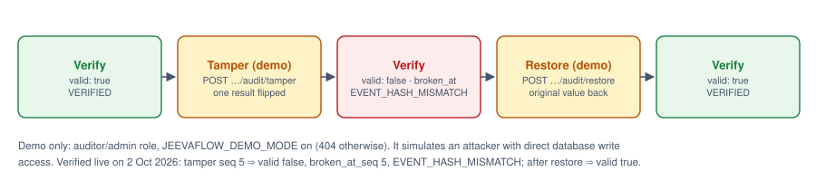

Figure 18.1 — Normal chain → PASS; tampered event → FAIL at that event; restored chain → PASS.

Live API result (2 Oct 2026):

| Step | Response |
|---|---|
| Verify | `valid: true`, 166 events |
| Tamper `seq 5` | `tampered_seq: 5` |
| Verify | `valid: false`, `broken_at_seq: 5`, `reason: EVENT_HASH_MISMATCH` |
| Restore | `restored: 1` |
| Verify | `valid: true` (the AUDIT_CHAIN_BROKEN event itself stays in the chain) |

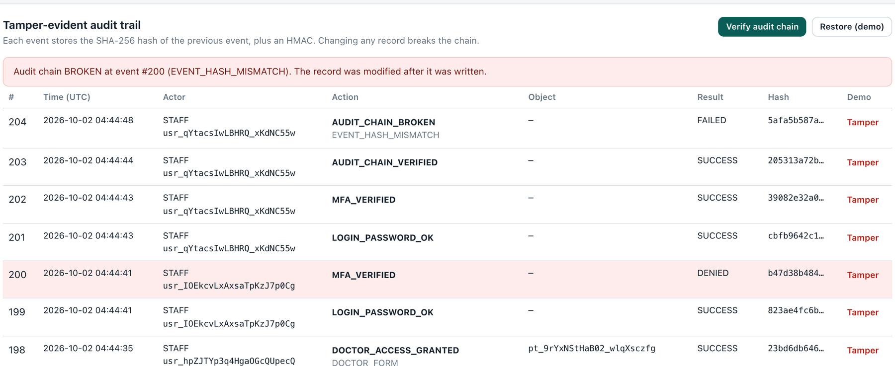

Figure 18.2 — Security page after tampering with event #200: “Audit chain BROKEN at event #200 (EVENT_HASH_MISMATCH)”, with the modified row highlighted.

This is a **security demonstration**, not a production feature. In production these endpoints return 404 because demo mode cannot be enabled there.

## 19. Data Retention

Retention is implemented in `retention.py`. `run_retention()` runs at server start and **every 300 seconds**; an admin can also trigger it with `POST /api/v1/admin/retention/run`.

| Rule | Behaviour |
|---|---|
| Unverified uploads | Quarantined documents whose transaction is `EXPIRED` or `LOCKED` are crypto-shredded (reason `UNVERIFIED_EXPIRED`) |
| Retention period | Every document gets `retain_until = received + 90 days` (`JEEVAFLOW_DOCUMENT_RETENTION_DAYS`); past that it is crypto-shredded (reason `RETENTION`, audited as `DOCUMENT_RETENTION_EXPIRED`) |
| Consents | Consents past expiry are audited once as `CONSENT_EXPIRED` |
| Tokens and sessions | Expired evidence tokens (after 5 minutes) and expired sessions (after 1 hour) are deleted |
| Patient deletion | `DELETE /api/v1/portal/documents/{ref}` crypto-shreds a document on request |
| Demo reset | `POST /api/v1/demo/reset` crypto-shreds all synthetic demo documents (demo mode, localhost only) |

**Deletion order:**

1. Destroy the wrapped data key.
2. Overwrite and unlink the encrypted object.
3. Delete the dependent rows (evidence, observations, commitments, facts, matches).
4. Write the audit event.

The key is destroyed **first** because overwriting files is not guaranteed on SSDs or copy-on-write filesystems. Once the key is gone, any leftover ciphertext is unreadable.

Live admin run on a fresh instance: `{transactions_expired: 0, unverified_documents_deleted: 0, retention_deleted: 0, consents_expired: 0}`. Nothing was due.

**Why it matters:** limiting how long data exists limits what a future breach, subpoena or misconfiguration can expose. Unverified uploads (for example, media sent from a phone that is not the patient’s) disappear within the transaction lifetime.

The consent record also stores a `retention_days` value (90). Document expiry itself uses the global setting, so a per-consent retention period is not enforced separately.

## 20. Security Status

`GET /api/v1/security/status` (any MFA-verified staff role) returns a **live, self-describing security posture**:

- environment;
- demo mode;
- generation time;
- the current audit-chain verification result;
- **16 controls**, each with a status, a detail line, a grade (`IMPLEMENTED`, `DEMO IMPLEMENTATION` or `PRODUCTION REQUIRED`) and the named production replacement.

| Control | Live status | Grade |
|---|---|---|
| Encryption | ACTIVE | IMPLEMENTED |
| Key management | ACTIVE | DEMO IMPLEMENTATION (KEK from environment) |
| OTP Protection | ACTIVE | IMPLEMENTED |
| Consent | ACTIVE / ENFORCED | IMPLEMENTED |
| Doctor MFA | ACTIVE | IMPLEMENTED |
| File Scan | PASSED | DEMO IMPLEMENTATION (heuristic engine; ClamAV not installed) |
| OCR | PRIVATE | DEMO IMPLEMENTATION (process isolation, not container) |
| External AI | DISABLED | IMPLEMENTED |
| PHI Logging | BLOCKED | IMPLEMENTED |
| Audit Chain | VERIFIED | IMPLEMENTED |
| Document Access | AUTHORIZED | IMPLEMENTED |
| Document Retention | ACTIVE | IMPLEMENTED |
| WhatsApp Channel | ENFORCED | DEMO IMPLEMENTATION (no restricted Twilio API key configured) |
| Rate limiting | ACTIVE | DEMO IMPLEMENTATION (in-memory) |
| Transport | LOCAL HTTP | DEMO IMPLEMENTATION |
| Database encryption at rest | FIELD-LEVEL | PRODUCTION REQUIRED |

The endpoint’s own statement is deliberately modest (“Defense-in-depth security architecture…”), and the page footer states that these technical controls “do not by themselves establish regulatory compliance” (`test_security_dashboard_is_honest`).

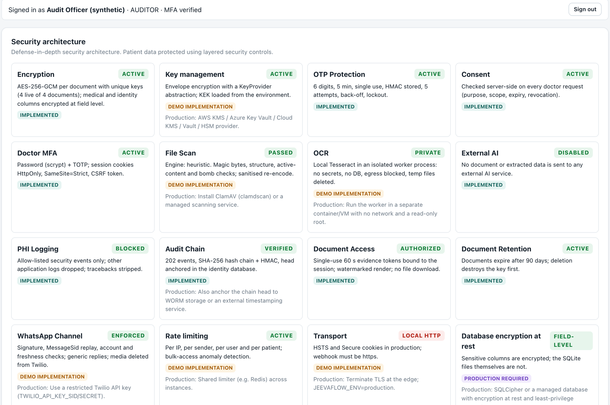

Figure 20.1 — Security page (auditor session) showing control grades and named production replacements.

## 21. Frontend

The frontend (`frontend/`, React 19 + TypeScript + Vite, plain CSS) has four sections reachable from the top navigation. The Vite dev server proxies `/api` to the backend so the browser talks to a single origin. Every page shows the principle banner and a footer stating that data is synthetic and that JeevaFlow does not diagnose, prescribe or change medication. All screenshots in this report are from a live run against an isolated synthetic instance on 2 October 2026.

| Screen | Purpose | Key components |
|---|---|---|
| **Doctor console** (`/`) | Staff sign-in (password → TOTP); “My patients” (consented only); tabs *Doctor-ready form* and *Journey & review* | `DoctorConsole.tsx`, `StaffLogin.tsx`, `DoctorForm.tsx`, `Timeline.tsx`, `OpenLoops.tsx`, `Conflicts.tsx`, `SecureEvidence.tsx`, `EvidenceViewer.tsx` |
| **Patient portal** (`/portal`) | OTP entry; consents (grant, Revoke, End now); documents with status, scan result and retention date; upload or camera capture | `PatientPortal.tsx`, `DocumentUpload.tsx`, `CameraCapture.tsx`, `DocumentsList.tsx` |
| **Security** (`/security`) | Control grid from `/security/status`; tamper-evident audit trail with Verify, Tamper and Restore (demo) | `SecurityDashboard.tsx` |
| **Demo** (`/demo`) | Synthetic WhatsApp phone (four documents, “Hi”, forged signature); webhook result; demo accounts; Reset demo | `DemoConsole.tsx`, `StoryStrip.tsx` |

Frontend security details:

- CSRF tokens are kept in memory only, never in `localStorage`.
- Evidence images exist only as in-memory blob URLs.
- Upload progress shows the backend’s real pipeline stages.

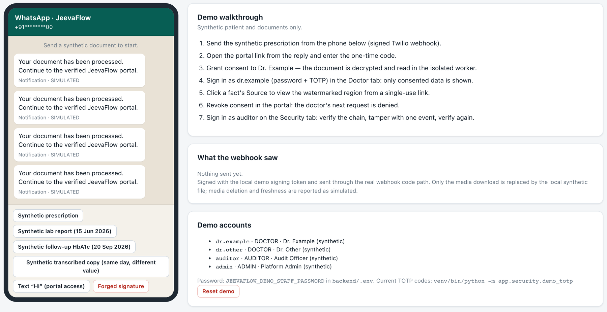

Figure 21.1 — Demo control room: synthetic phone with the four synthetic documents, the generic replies (notifications marked SIMULATED) and the seeded synthetic accounts.

## 22. Backend and Verified Technology Stack

The backend is a single FastAPI application (`app/main.py`, version 2.0.0) with seven routers, served by Uvicorn. It loads configuration from the environment and refuses to start without its secrets. A background task runs the retention job every five minutes.

API hardening in `main.py`:

- **Origin check:** state-changing requests from a foreign `Origin` are rejected.
- **Request-size cap:** oversized requests are refused before they are read.
- **Security headers:**
  - `nosniff`
  - `X-Frame-Options: DENY`
  - `Referrer-Policy: no-referrer`
  - `Cross-Origin-Resource-Policy: same-origin`
  - `Permissions-Policy` (camera, microphone and geolocation disabled)
  - CSP `default-src 'none'` and `no-store` on API responses
  - HSTS in production
- **Strict CORS:** only the configured origins.
- **Generic errors:** generic 500s and validation errors that do not echo input.
- **Upload handling:** uploads are kept in memory, never spooled to disk.

### Verified Technology Stack

| Technology | Purpose | Where used | Verified? |
|---|---|---|---|
| Python 3 (venv: 3.14) | Backend language | `backend/` | ✔ interpreter in `venv` |
| FastAPI 0.142 | REST API framework | `app/main.py`, `app/routes/*` | ✔ `requirements.txt`, installed |
| Uvicorn | ASGI server | `python -m app`, `run_demo.sh` | ✔ |
| Pydantic / pydantic-settings | Request validation | route models | ✔ |
| SQLAlchemy + SQLite | ORM; `jeevaflow.db` and separate `identity.db` | `database.py`, `identity.py`, `models.py` | ✔ |
| cryptography (AESGCM, HKDF) | AES-256-GCM documents and fields; key derivation | `security/crypto.py` | ✔ |
| hashlib scrypt, hmac (stdlib) | Password hashing; TOTP (RFC 6238, own implementation); OTP/session HMACs | `security/auth.py`, `security/otp.py` | ✔ |
| PyMuPDF 1.28 | PDF parsing, text layer, rendering, sanitisation, structural active-content scan | `worker.py`, `security/pdf_active_content.py` | ✔ |
| Tesseract 5.5.3 via pytesseract | Local OCR | `worker.py`, `ocr.py` | ✔ binary installed |
| Pillow | Image decode, re-encode, watermark rendering | `worker.py` | ✔ |
| OpenCV + NumPy | Image quality gate (sharpness, brightness) | `quality.py` | ✔ |
| ClamAV | Signature malware scan **if installed** | `security/scanner.py` | ✘ not installed here (heuristic engine used) |
| httpx | Twilio REST (media download/delete, notifications, freshness) | `whatsapp.py` | ✔ code; live Twilio not exercised in this audit |
| Twilio WhatsApp | Messaging transport | `whatsapp.py`, `routes/webhook.py` | ◐ signature path verified via simulator; credentials not configured |
| python-dotenv | `.env` loading | `config.py` | ✔ |
| pytest | Backend tests | `backend/tests/` | ✔ 156 passed |
| React 19 + TypeScript + Vite 8 | Frontend | `frontend/` | ✔ `package.json` |
| Vitest + Testing Library | Frontend tests | `frontend/src/test/` | ✔ 8 passed |
| Generative AI / LLM | — | — | **Not used** (no AI SDK in requirements; dashboard: External AI DISABLED) |

## 23. API Architecture

All routes below were read from the application’s routers (`app/routes/*.py`) and match the OpenAPI listing (served at `/docs` and `/openapi.json` in development only).

Notation:

- **Staff** means an MFA-verified staff session.
- **Consent** means `authorize_doctor()` with the named scope.
- **CSRF** means the `X-CSRF-Token` header, required on every state-changing session request.
- **Demo-local** means demo mode, a loopback client, a local `Host` header and no proxy headers.

| Group | Method | Endpoint | Purpose | Security requirement | Role |
|---|---|---|---|---|---|
| Health | GET | `/` | Service name, version | Public | Any |
| Health | GET | `/api/v1/health` | Liveness | Public | Any |
| WhatsApp | POST | `/api/v1/webhooks/whatsapp` | Inbound messages and media | Twilio signature (fails closed), replay, account, freshness, rate limits | Twilio |
| Patient portal | POST | `/api/v1/portal/verify` | Verify OTP, start session | Transaction + OTP; IP rate limit | Patient |
| Patient portal | GET | `/api/v1/portal/session` | Patient overview, options | Patient session | Patient |
| Patient portal | POST | `/api/v1/portal/logout` | End session | Patient session + CSRF | Patient |
| Consent | POST | `/api/v1/portal/consents` | Grant consent (and process pending documents) | Patient session + CSRF | Patient |
| Consent | POST | `/api/v1/portal/consents/{consent_ref}/apply` | Share pending documents under an existing consent | Patient session + CSRF; consent active | Patient |
| Consent | POST | `/api/v1/portal/consents/{consent_ref}/revoke` | Revoke | Patient session + CSRF; own consent | Patient |
| Consent | POST | `/api/v1/portal/consents/{consent_ref}/expire` | End now | Patient session + CSRF; own consent | Patient |
| Documents | POST | `/api/v1/portal/documents` | Upload (validate → scan → encrypt → process) | Patient session + CSRF + active consent; upload rate limit | Patient |
| Documents | GET | `/api/v1/portal/documents` | List own documents | Patient session | Patient |
| Documents | DELETE | `/api/v1/portal/documents/{document_ref}` | Crypto-shred own document | Patient session + CSRF | Patient |
| Authentication | POST | `/api/v1/auth/login` | Password step | Lockout, rate limits, generic errors | Staff |
| Authentication | POST | `/api/v1/auth/mfa` | TOTP step | Pending-MFA cookie; replay block | Staff |
| Authentication | GET | `/api/v1/auth/me` | Current staff user + CSRF token | Staff | Doctor / Auditor / Admin |
| Authentication | POST | `/api/v1/auth/logout` | End session | Staff + CSRF | Doctor / Auditor / Admin |
| Doctor | GET | `/api/v1/doctor/patients` | Patients with active consent to me | Staff | Doctor |
| Doctor | GET | `/api/v1/doctor/patients/{patient_ref}/form` | Doctor-ready form | Consent (sections by scope) | Doctor |
| Doctor | GET | `/api/v1/doctor/patients/{patient_ref}/journey` | Timeline, loops, conflicts, documents | Consent (sections by scope) | Doctor |
| Doctor | GET | `/api/v1/doctor/patients/{patient_ref}/loops` | Open Loops | Consent: INSTRUCTIONS | Doctor |
| Doctor | GET | `/api/v1/doctor/patients/{patient_ref}/conflicts` | Conflicts | Consent: LABS | Doctor |
| Doctor | PATCH | `/api/v1/doctor/observations/{observation_id}/verify` | Verify observation | Consent: LABS + CSRF; evidence required | Doctor |
| Doctor | PATCH | `/api/v1/doctor/observations/{observation_id}/reject` | Reject (withdraws matches) | Consent: LABS + CSRF | Doctor |
| Doctor | PATCH | `/api/v1/doctor/facts/{fact_ref}/confirm` | Confirm medication/allergy fact | Consent: category scope + CSRF | Doctor |
| Doctor | PATCH | `/api/v1/doctor/facts/{fact_ref}/reject` | Reject fact | Consent: category scope + CSRF | Doctor |
| Doctor | GET | `/api/v1/doctor/commitments/{commitment_id}` | Loop detail + history | Consent: INSTRUCTIONS | Doctor |
| Doctor | POST | `/api/v1/doctor/commitments/{commitment_id}/confirm-completion` | Close loop | Consent: INSTRUCTIONS + CSRF; potential match | Doctor |
| Doctor | POST | `/api/v1/doctor/commitments/{commitment_id}/keep-open` | Dismiss matches | Consent: INSTRUCTIONS + CSRF | Doctor |
| Doctor | POST | `/api/v1/doctor/commitments/{commitment_id}/review` | Mark needs review | Consent: INSTRUCTIONS + CSRF | Doctor |
| Evidence | GET | `/api/v1/doctor/evidence/{evidence_id}` | Quote, location, linked items | Consent + evidence scope | Doctor |
| Evidence | POST | `/api/v1/doctor/evidence/{evidence_id}/view-token` | Issue 60 s single-use token | Consent: SOURCE_DOCUMENTS + CSRF; rate limit | Doctor |
| Evidence | GET | `/api/v1/doctor/evidence/view/{token}` | Watermarked PNG of the region | Same session + doctor; unused; unexpired; consent re-checked | Doctor |
| Security | GET | `/api/v1/security/status` | Live control status | Staff | Doctor / Auditor / Admin |
| Audit | GET | `/api/v1/audit/events` | Recent audit events | Staff | Auditor / Admin |
| Audit | POST | `/api/v1/audit/verify` | Verify chain | Staff + CSRF | Auditor / Admin |
| Demo | POST | `/api/v1/demo/audit/tamper` | Simulate DB tampering | Staff + CSRF + demo mode | Auditor / Admin |
| Demo | POST | `/api/v1/demo/audit/restore` | Undo simulated tampering | Staff + CSRF + demo mode | Auditor / Admin |
| Admin | POST | `/api/v1/admin/patients` | Enrol patient (generic error) | Staff + CSRF | Admin |
| Admin | GET | `/api/v1/admin/whatsapp/status` | Credential-free channel status | Staff | Admin |
| Admin | GET | `/api/v1/admin/whatsapp/messages` | Message log (masked senders) | Staff | Admin |
| Admin | POST | `/api/v1/admin/retention/run` | Run retention now | Staff + CSRF | Admin |
| Demo | GET | `/api/v1/demo` | Demo state | Demo-local | Local demo |
| Demo | POST | `/api/v1/demo/whatsapp` | Signed simulated WhatsApp message (real webhook path) | Demo-local | Local demo |
| Demo | GET | `/api/v1/demo/phone` | Synthetic phone view | Demo-local | Local demo |
| Demo | POST | `/api/v1/demo/reset` | Crypto-shred demo documents | Demo-local | Local demo |
| Demo | GET | `/api/v1/demo/files/{name}` | Download a synthetic demo PDF | Demo-local | Local demo |

## 24. Complete End-to-End Demo

A script judges can follow on a local machine with the demo running. It needs:

- the frontend at `http://localhost:5173`;
- demo mode enabled;
- **synthetic data only**.

The staff password is read from the local `.env`. TOTP codes come from `venv/bin/python -m app.security.demo_totp`. Neither is reproduced here.

| Step | Action (where) | What to observe | Backed by |
|---|---|---|---|
| 1 | **Demo** → *Synthetic prescription* | The synthetic phone sends a document | `POST /demo/whatsapp` |
| 2 | (automatic) | “What the webhook saw”: signature **VERIFIED**; *Forged signature* shows 403 | `routes/webhook.py` |
| 3 | Phone | Generic reply with portal link, then the code in a separate message | `REPLIES` |
| 4 | Open the link → **Patient portal** | Enter the 6-digit code; session starts (15 min) | `POST /portal/verify` |
| 5 | Portal → grant consent to *Dr. Example*, all scopes, 7 days | Consent ACTIVE | `POST /portal/consents` |
| 6 | (automatic) | Quarantined document decrypted and processed in the isolated worker; phone shows “processed” | `process_document()` |
| 7 | (automatic) | Medications, allergy, prescriber, instructions extracted with states | `extraction.py`, `facts.py` |
| 8 | (automatic) | Every item stored with quote, page, bbox (quote-or-reject) | `provenance.py` |
| 9 | **Doctor** → sign in `dr.example` → TOTP | “MFA verified” | `/auth/login`, `/auth/mfa` |
| 10 | Doctor → My patients | Only the consenting patient is listed; sign in as `dr.other` to see an empty list | `GET /doctor/patients` |
| 11 | *Journey & review* | Timeline, open loops, conflicts, shared documents | `…/journey` |
| 12 | *Doctor-ready form* | Medications with SOURCE_FACT / AI-inferred / Uncertain / Missing; labs; allergies; notes | `…/form` |
| 13 | Review medications and observations | Confirm or Reject facts; Verify or Reject observations | `PATCH …/facts/…`, `…/observations/…` |
| 14 | Send the *lab report* and *transcribed copy* (repeat 3–5 or apply existing consent) | Conflict HbA1c 9.4 % vs 8.2 % on 15 Jun 2026, “Human review required”; add the *follow-up* for a potential match | `…/conflicts`, `…/loops` |
| 15 | Form → *Source* → *View source region* | Highlighted, watermarked page render | `…/view-token`, `…/view/{token}` |
| 16 | (repeat the same token URL) | 403 `TOKEN_REUSED` | single-use token |
| 17 | **Patient portal** → *Revoke* | Consent REVOKED | `POST …/revoke` |
| 18 | Doctor → Refresh / open form | Patient gone; 403 on direct request | `authorize_doctor()` |
| 19 | **Security** → sign in `auditor` → *Verify audit chain* → *Tamper* → *Verify* → *Restore (demo)* → *Verify* | VERIFIED → BROKEN at that event → VERIFIED | `/audit/verify`, `/demo/audit/*` |

The same flow is automated by `backend/test_api.py` (steps 1–6, 9–10, 12, 15–19); `run_demo.sh` starts the server and runs it.

## 25. Security & Test Validation

<strong>156 automated backend tests passed in the current development environment</strong> (pytest, 2 October 2026). That is the 119-test suite documented in the README, plus 37 tests for the structural PDF active-content detector added on 2 October 2026. The frontend suite (Vitest) passed <strong>8 of 8</strong>. These results show the implemented controls behave as designed in this environment. They are <strong>not</strong> a certification, a penetration test or evidence of production readiness.

| Test file | Tests | Focus |
|---|---:|---|
| `tests/test_security.py` | 60 | OTP, consent, roles, MFA, CSRF, injection, files, encryption, evidence tokens, logging, audit chain, retention, worker isolation |
| `tests/test_pdf_active_content.py` | 37 | Structural PDF scanning: JavaScript, launch/remote actions, `/AA`, XFA, rich media, embedded files, C2PA manifests, malformed PDFs, pipeline and endpoint |
| `tests/test_whatsapp.py` | 19 | Signature, replay, account, freshness, unenrolled senders, media download/deletion, generic replies, rate limits |
| `tests/test_core.py` | 17 | Ingestion, provenance, OCR, image quality gate, extraction, idempotency |
| `tests/test_facts.py` | 13 | Medication/allergy/prescriber extraction and fact states |
| `tests/test_loops.py` | 10 | Open Loops, conflicts, potential matches, doctor form sections and scopes |
| **Total (backend)** | **156** | **all passed** |

### Live security smoke test (`backend/test_api.py`)

Re-run for this report on 2 October 2026 against an isolated instance (fresh random keys, temporary databases, synthetic patient). **13 of 13 checks passed.**

| Test | Result |
|---|:-:|
| Health | PASS |
| WhatsApp signature verification | PASS |
| Generic WhatsApp reply | PASS |
| OTP verification | PASS |
| Consent + document processing | PASS |
| Doctor password + TOTP MFA | PASS |
| Consent-based patient visibility (“doctor sees only the consented patient”) | PASS |
| Doctor-ready form (with medications) | PASS |
| Watermarked evidence | PASS |
| Single-use evidence token | PASS |
| Immediate access revocation | PASS |
| Auditor MFA | PASS |
| Audit chain verification | PASS |

Additional live checks performed for this report:

| Check | Result |
|---|---|
| Dr. Other with no consent | Empty list; form request 403 |
| Conflict detection | HbA1c 9.4 % vs 8.2 % on 15 Jun 2026: `HUMAN_REVIEW_REQUIRED` |
| Potential match | 20 Sep 2026 HbA1c result matched to the “Repeat HbA1c” loop |
| Tamper demo | Chain broken at seq 5 (`EVENT_HASH_MISMATCH`), then restored to valid |
| Role separation | 403 / 200 exactly as in the matrix in Section 13 |
| TOTP replay blocked | Reusing a 30-second code returned 401 |
| Per-sender webhook rate limit | Triggered after repeated messages |
| Structural PDF scan | A static PDF carrying a C2PA manifest was accepted, and the manifest was stripped from the stored copy |

## 26. Security Threat Model

Only defenses present in the code are listed. “Evidence” names the automated test(s) or the live check.

| Threat | JeevaFlow defense | Evidence |
|---|---|---|
| Forged or replayed WhatsApp webhook | HMAC signature (fails closed), MessageSid replay table, AccountSid and freshness checks | `test_unsigned_and_wrongly_signed_requests_are_rejected`, `test_replayed_message_sid_is_ignored`, `test_stale_message_is_dropped`; live PASS |
| Compromised or shared phone / chat history | Chat carries no medical content; data only via OTP-verified portal; quarantine until consent | `test_replies_contain_no_medical_information`, `test_media_is_quarantined_until_otp_and_consent` |
| Unknown sender pushing files | Generic reply, no download, no patient created | `test_unenrolled_number_gets_generic_reply_and_no_download` |
| OTP guessing / reuse | 5 attempts + back-off + lock, single use, 5-min expiry, HMAC storage | `test_otp_brute_force_locks_transaction`, `test_otp_is_single_use`, `test_otp_never_stored_in_plaintext` |
| Unauthorized doctor access | Password + TOTP MFA, then consent + scope on every request | `test_password_alone_is_not_enough`, `test_wrong_doctor_is_denied`; live PASS |
| Stolen password | TOTP second factor, lockout, generic errors | `test_login_errors_are_generic_and_lock_out` |
| Intercepted TOTP code | Used time-step stored; replay refused | `test_totp_code_cannot_be_replayed`; observed live |
| Session hijack / CSRF | HttpOnly SameSite=Strict cookies, HMAC-stored tokens, CSRF header, Origin check, idle timeout | `test_csrf_token_required_for_state_changes`, `test_foreign_origin_rejected`, `test_idle_session_expires` |
| Patient enumeration | No list-all endpoint; identical 403 for unknown and unconsented objects; random refs | `test_unknown_and_foreign_objects_look_the_same`, `test_no_list_all_patients_or_phone_lookup` |
| Insider bulk access | Per-doctor rate limit and >25-patients/hour anomaly denial | `test_bulk_access_anomaly` |
| Consent withdrawal not honoured | Consent re-queried on every request, including evidence view time | `test_expired_consent_denied`, `test_evidence_view_requires_source_scope_and_live_consent`; live PASS |
| Evidence URL reuse / forwarding | Single-use, 60 s, session-bound token; watermark; no download | `test_evidence_token_single_use_short_lived_session_bound`, `test_no_direct_document_download`; live PASS |
| Malicious file (malware, active PDF, bombs) | Magic bytes, isolated worker, structural PDF scan, sanitise, scan both copies, fail closed | `test_malicious_files_rejected`, `test_decompression_bomb_rejected`, `test_pdf_active_content.py` |
| Parser exploit reaching secrets | Worker has no secrets, no DB, no network, CPU/core limits | `test_worker_environment_has_no_secrets`, `test_worker_blocks_network` |
| Storage theft | AES-256-GCM per-document keys; field encryption; separate identity DB | `test_documents_and_fields_are_encrypted_at_rest`, `test_identity_is_separate_from_medical_data` |
| Hallucinated / misread clinical data | Rule-based extraction, quote-or-reject, states, doctor confirmation | `test_unanchored_extraction_is_rejected`, `test_never_invents_frequency_or_duration` |
| Document conflict | Conflict detection with both sources preserved; never auto-resolved | `test_conflict_detection_and_rejection`; live check |
| Audit tampering / truncation | Hash chain + HMAC, append-only triggers, anchored head | `test_audit_chain_verifies_and_detects_tampering`, `test_audit_detects_deleted_tail`; live tamper demo |
| PHI leaking into logs | Allow-listed log events and fields; tracebacks stripped; no input echo | `test_no_phi_in_logs`, `test_validation_errors_do_not_echo_input` |
| Injection / XSS | ORM parameters; JSON API with CSP `default-src 'none'`; React escaping | `test_sql_injection_attempts_are_inert`, `test_xss_payload_is_data_not_markup` |
| Data over-retention | 90-day crypto-shredding; unverified uploads shredded on transaction expiry | `test_expired_unverified_transaction_documents_are_shredded`, `test_delete_document_destroys_key_object_and_rows` |
| Demo controls exposed publicly | Demo routes require demo mode, loopback, local Host and no proxy headers | `test_demo_controls_refuse_proxied_requests` |

## 27. Security Design Principles

| # | Principle | How it shows up in the code |
|---|---|---|
| 1 | **Defense in depth** | Twelve independent layers (Section 31); e.g. a malicious PDF must pass validation, worker inspection, the structural scan, sanitisation and the scanner, and is then still only quarantined |
| 2 | **Least privilege** | Admin and auditor cannot read clinical data; doctors see only consented patients and scopes; the worker gets no secrets, DB or network |
| 3 | **Explicit consent** | Patient-chosen doctor, scopes and duration; no implied consent from sending a message |
| 4 | **Separation of communication and data storage** | WhatsApp carries generic templates only; documents live encrypted in the vault; identities in a separate database |
| 5 | **Strong authentication** | Patients: transaction-bound OTP. Staff: scrypt password + TOTP with replay protection, lockout and idle timeout |
| 6 | **Source provenance** | Quote-or-reject; every value has quote, page, bbox, confidence and document hash |
| 7 | **Auditability** | Every security-relevant action is chained, signed and verifiable by an independent role |
| 8 | **Revocability** | Consent revocation and “end now” take effect on the next request; documents can be crypto-shredded on demand |
| 9 | **Data minimisation** | Scope-limited views; references instead of identities; no PHI in logs or audit; retention limits; image metadata stripped |
| 10 | **Human / doctor review** | Everything starts in REVIEW; conflicts are never resolved and loops never closed automatically; the doctor is the final gate |

## 28. What JeevaFlow Does Not Do

JeevaFlow organises and secures <em>documented</em> information for <em>authorized</em> clinical review. It does <strong>not</strong>:

<ul>
<li>diagnose patients or interpret whether a value is good or bad;</li>
<li>replace doctors or make final clinical decisions;</li>
<li>prescribe, recommend, or independently change medication;</li>
<li>decide which of two conflicting values is correct;</li>
<li>close a care loop without a named, MFA-verified doctor;</li>
<li>treat WhatsApp as the secure medical-data vault (no clinical content is sent over it);</li>
<li>send documents or extracted data to any external AI service;</li>
<li>claim regulatory certification. It has not been assessed or certified under HIPAA, DPDP or any other framework, and the README states that these technical controls do not by themselves make it compliant.</li>
</ul>

## 29. Limitations / Development Status

This section is intentionally complete. JeevaFlow is a **hackathon MVP** running in a **local development environment** with **synthetic data only**. Do not use it with real patient data without the production replacements below and an independent security review.

### 29.1 Demo-grade components (labelled as such in the product)

| Area | Current state | Production requirement |
|---|---|---|
| Key management | KEK loaded from an environment variable (`LocalKeyProvider`) | Cloud KMS / Key Vault / HSM behind the existing `KeyProvider` interface |
| Malware scanning | Heuristic engine in this environment (ClamAV not installed) | ClamAV or a managed scanning service |
| Worker isolation | Separate process with in-process egress block | Container/VM with no network and a read-only root |
| Rate limiting | In-memory, per process (resets on restart; observed during this audit) | Shared limiter (e.g. Redis) |
| Database | SQLite with field-level encryption; the database files themselves are not encrypted; additive schema upgrades, no migration framework | SQLCipher or a managed database with encryption at rest and least-privilege accounts |
| Transport | Local HTTP | TLS at the edge, `JEEVAFLOW_ENV=production` (HTTPS, Secure cookies, demo mode and API docs disabled) |
| Frontend | No CSP of its own in dev | Serve with a strict CSP header |
| Audit anchor | Chain head anchored in the identity DB | WORM storage or external timestamping |

### 29.2 WhatsApp status

The Twilio integration (signature verification, REST media download/deletion, freshness check, notifications) is implemented and unit-tested with mocks. **For this audit no Twilio credentials were configured.** The demo used the built-in simulator, which signs messages locally and sends them through the real webhook code. Media download is replaced by a local synthetic file, and media deletion, freshness and outbound notifications are reported `SIMULATED`. A live end-to-end run through Twilio’s WhatsApp sandbox was **not verified** in this audit. Also:

- No restricted Twilio API key was configured.
- Webhook processing is synchronous, so very large scanned PDFs may approach Twilio’s 15-second timeout.

### 29.3 Functional limitations

- **Extraction scope:**
  - Lab tests: five (HbA1c, glucose, creatinine, LDL, blood pressure).
  - Instruction verbs: five families (repeat, follow-up, review, refer, recheck).
  - Medicines: a 20-entry formulary.
  - Not reliably understood: free-text notes, unusual table layouts and handwriting.
- **Dates:** read day-first (DD/MM/YYYY). If no report date is found, the date received is used.
- **OCR:** quality depends on Tesseract and the image. The `RETAKE` gate refuses only clearly unreadable images.
- **Consent model:**
  - One purpose (`CLINICAL_REVIEW`).
  - No doctor-initiated request flow.
  - The per-consent `retention_days` field is informational; document retention uses the global 90-day setting.
- **Identifiers:** observation, commitment and evidence IDs in the doctor API are sequential integers. They are protected by authorization and uniform 403s, but they are not opaque.
- **Staff accounts:**
  - Four seeded synthetic accounts.
  - No staff enrolment or MFA-reset UI.
  - Demo TOTP secrets are derived from a demo seed.
- **Watermarking:** discourages and attributes leaks; it cannot prevent screen photography.
- **Audit log retention:** unbounded; no archival policy.
- **Demo surfaces:**
  - The demo phone view shows OTP codes so the demo can run without a phone.
  - Demo routes are restricted to localhost and demo mode.
- **Not performed:** penetration test, threat-modelling workshop, formal privacy impact assessment, compliance assessment, load or availability testing.

### 29.4 Security assumptions

- The host running the backend is trusted and not compromised.
- Secrets in `.env` are protected (generated by `init_secrets`, file mode 600, git-ignored).
- Twilio’s signing token is kept secret.
- Staff devices and authenticator apps are under staff control.
- Users access the portal over a secure network in production.

## 30. Future Extensions

<strong>Everything in this section is planned or proposed. None of it is implemented today.</strong>

| Area | Future work |
|---|---|
| Messaging | Production WhatsApp Business sender with a restricted API key; asynchronous webhook processing (queue) for large documents |
| Identity | Enterprise identity integration (OIDC/SAML SSO) for staff, with MFA policy enforcement and staff enrolment / recovery flows |
| Keys | Cloud KMS or HSM-backed KEK via the existing `KeyProvider` seam; key rotation |
| Malware | ClamAV or a managed multi-engine scanning service; content disarm and reconstruction |
| Platform | Containerised worker with no network and a read-only root; managed database with encryption at rest; Redis rate limiting; migrations |
| Compliance | Formal compliance assessment (e.g. DPDP, HIPAA where applicable), privacy impact assessment, independent penetration test |
| Operations | Deployment hardening, observability (metrics, alerting on audit events and anomalies), disaster recovery, high availability, backup with key separation |
| Audit | External anchoring of the audit-chain head (WORM storage / timestamping), audit archival policy |
| Extraction | Broader test and medication coverage, table-aware parsing; any ML-assisted extraction would remain quote-or-reject and doctor-confirmed |
| Analytics | Privacy-preserving, aggregate analytics; federated learning only as a possible *future* analytics architecture, subject to consent and governance |

## 31. Final Security Summary

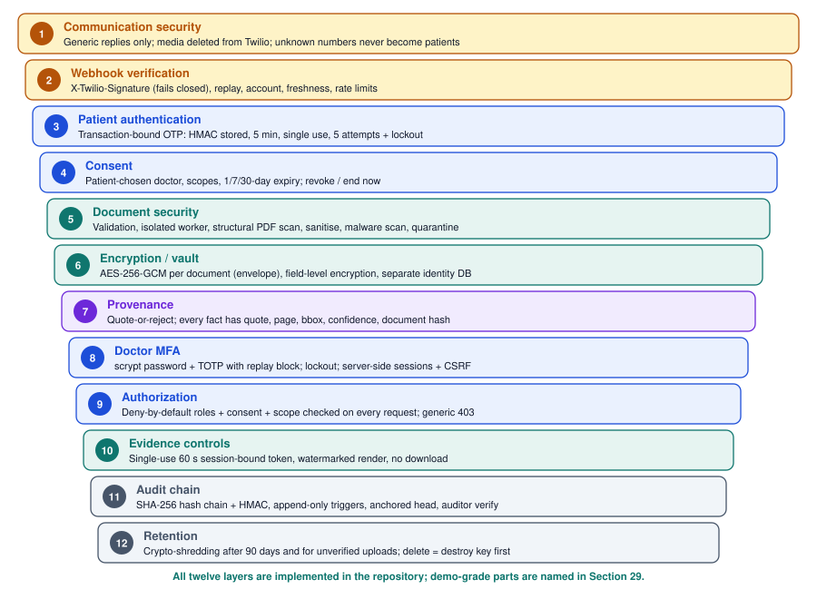

Figure 31.1 — Defense in depth: twelve layers, all present in the repository. Demo-grade parts of individual layers are listed in Section 29.

JeevaFlow’s security model rests on one separation and three gates:

- **The separation.** WhatsApp carries the interaction; JeevaFlow holds the data.
- **The patient gate.** A transaction-bound OTP, then explicit, scoped, revocable consent.
- **The clinician gate.** Password + TOTP, then consent and scope checked on every request.
- **The accountability gate.** Every action is recorded in a tamper-evident chain that an independent auditor can verify.

Between the gates, every document is isolated, sanitised, scanned, encrypted with its own key and kept only as long as necessary. Every clinical value carries its source. These properties were verified in code, by 156 automated backend tests and 8 frontend tests, and by a 13-step live run in the development environment. The production replacements in Section 29 remain to be done.

## Appendix A. Audit Method and Evidence

**Scope reviewed (2 October 2026):**

| Area | What was reviewed |
|---|---|
| Backend application | `backend/app/` (all modules, routers and security package) |
| Tests and scripts | `backend/tests/`, `test_api.py`, `seed_demo.py`, `run_demo.sh` |
| Configuration | `requirements.txt`, `.env.example` |
| Frontend | `frontend/src/` pages and components, `package.json`, `vite.config.ts` |
| Documentation | `README.md`, `docs/` |
| Demo data | the four synthetic PDFs in `data/demo/` |

`backend/.env` was **not** opened.

**Execution:**

1. Ran the backend suite (`pytest`): 156 passed.
2. Ran the frontend suite (`vitest`): 8 passed.
3. Started an **isolated** backend with freshly generated random keys, temporary databases and vault, no Twilio credentials, and a placeholder synthetic phone number.
4. Ran `test_api.py`: 13/13 passed.
5. Ran an additional verification script covering conflicts, loops, roles, tamper/restore, retention and security status.
6. Captured all screenshots with headless Chrome against that instance. One-time codes and transaction references were masked before capture.

**Excluded from this document:** passwords, TOTP seeds or codes, API keys, Twilio credentials, session or evidence tokens, encryption keys, and real phone numbers. Screenshots show only synthetic names and opaque references (`pt_…`, `usr_…`) generated by the throwaway instance. The masked phone shown (`+91********00`) belongs to a placeholder number used only for this run.

**Team attribution:** the team name *Team Geek* was supplied by the project team. It does not appear in the repository.

**Report assets:**

| Asset | Location | Produced by |
|---|---|---|
| Diagrams | `docs/report/assets/diagrams/*.svg` | `docs/report/build/diagrams.py` |
| Screenshots | `docs/report/assets/screenshots/` | headless Chrome against the isolated instance |
| PDF | `JeevaFlow_Security_Features_Report.pdf` | `docs/report/build/build_pdf.mjs`, rendered from this Markdown |
